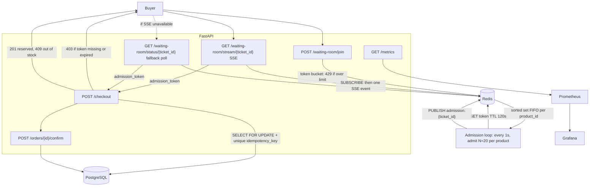

# FlashBuy

FlashBuy is a flash-sale checkout backend. It sells a limited number of units under concurrent demand without overselling, by combining a Redis waiting room, row-level locks in PostgreSQL, idempotency keys, and reservation expiry.

Headline numbers from a Locust run of 500 concurrent users against a product with stock 500. Full tables and method are in [docs/load_test_results.md](docs/load_test_results.md).

| Metric | Result |
| --- | --- |
| Concurrent users tested | 500 |
| Successful checkouts | 500 |
| Final stock | 0 (zero oversold) |
| Checkout latency (p50 / p95 / p99) | 140ms / 780ms / 970ms |
| Peak aggregate RPS | 204.00 |

## Why this matters

Flash sales fail in a specific way. Thousands of people hit the same SKU in the same second, whether that is a concert on-sale, a Black Friday drop, or a console restock. The naive read-then-write path lets two transactions both see `stock > 0` and both succeed, so the shop sells more units than it has. Even after the write path is correct, the database still cannot absorb every concurrent checkout. Connections, lock waits, and query time pile up, and the site times out for everyone, including people who would have gotten a unit.

A waiting room that is correct but **polls** still fails at scale: 5000 clients asking "am I admitted yet?" once a second is thousands of Redis round trips that almost always say no. FlashBuy admits on a drip and **pushes** the token over SSE when that buyer's turn comes. Polling remains as a fallback for clients that cannot hold a stream.

That is a production infrastructure problem, not a toy race condition. Commercial virtual waiting rooms and anti-oversell systems (for example Queue-it) exist because e-commerce and ticketing sites need to drip buyers into checkout instead of opening a database transaction per visitor. FlashBuy is a small implementation of that same category of system. It is not a product competing with those vendors.

## Architecture

Buyer traffic goes through the waiting room before it can take a PostgreSQL row lock. Observability is a separate scrape path. It does not sit on the checkout hot path.



What that maps to in the code:

- `POST /waiting-room/join` (`app/routes/waiting_room.py`) applies a Redis token-bucket limit (5 joins per minute per `buyer_id`, 20 per IP), then `ZADD`s the ticket onto a per-product sorted set (`app/waiting_room.py`).
- A background task in `app/main.py` sleeps `ADMISSION_TICK_SECONDS` (default 1) and calls `admit_waiting_buyers`, which pops up to `ADMISSION_BATCH_SIZE` (default 20) waiters per product, writes a short-lived admission token in Redis (default TTL 120 seconds), and `PUBLISH`es on `flashbuy:admission:{ticket_id}`.
- `GET /waiting-room/stream/{ticket_id}` is the primary wait path: SSE. It reads current status first (so a ticket already admitted is not missed), then subscribes to that ticket's channel. Heartbeats keep proxies from dropping an idle wait.
- `GET /waiting-room/status/{ticket_id}` is the documented **fallback** for clients or networks that cannot use SSE. It still returns live queue position, or the token once admitted. It is not removed.
- `POST /checkout` requires that token unless the internal header `X-FlashBuy-Test-Bypass: 1` is set (used by pytest and `scripts/prove_race_condition.py` only). It then `SELECT ... FOR UPDATE` on the product row, rejects with 409 if stock is 0, otherwise inserts a `reserved` order with a unique `idempotency_key` and decrements stock. A replay of the same key returns the original order and does not take another unit.
- `POST /orders/{order_id}/confirm` moves `reserved` to `confirmed`. A sweeper expires holds past `expires_at` (default 5 minutes from checkout) and returns the unit to stock.
- `GET /metrics` is scraped by Prometheus. Grafana is provisioned to use that Prometheus datasource and load the FlashBuy flash sale dashboard.

## How it was built

Phase 1 shipped a working but unsafe checkout: read stock, insert an order, decrement, with no lock. The point was a real oversell bug, not a stub.

Phase 2 added `scripts/prove_race_condition.py` (50 concurrent checkouts against stock 10). Against Phase 1 that run produced 50 successes and a remaining stock of 6, which is overselling. Checkout was then changed to `SELECT FOR UPDATE`, unique idempotency keys, `reserved` orders with `expires_at`, and a confirm plus expiry path. The same script then reported 10 successes and stock 0. Numbers are in `docs/race-condition-proof.md`.

Phase 3 put Redis in front of checkout. The waiting room is a sorted set plus a drip-feed admission loop. Join is rate-limited with an atomic Lua token bucket so one `buyer_id` or IP cannot occupy the whole line.

Phase 4 added `prometheus-client` metrics, a Prometheus scrape config, a pre-provisioned Grafana dashboard, and a Locust file that walks join, status poll, then checkout. A 2000-user Locust run was attempted. Locust reported CPU usage too high, status polls returned thousands of HTTP 500s, and join latency was dominated by that overload, so those percentiles are not used as results. The recorded run is 500 users, which is enough to exhaust stock 500 without saturating the load generator. That choice is documented in `docs/load_test_results.md`.

## Tech stack

From `requirements.txt` and `docker-compose.yml`:

| Piece | What it is used for |
| --- | --- |
| FastAPI, Uvicorn | Async HTTP API |
| Pydantic | Request and response models |
| SQLAlchemy (async) + asyncpg | PostgreSQL access |
| PostgreSQL 16 | Products and orders |
| Redis 7 | Waiting-room queue, admission tokens, rate limits |
| prometheus-client | `/metrics` |
| Prometheus v2.55.1 | Scrape and store metrics |
| Grafana 11.3.0 | Provisioned dashboard |
| Locust | Journey load test |
| pytest, pytest-asyncio, httpx | Automated tests |
| Docker Compose | Local app, Postgres, Redis, Prometheus, Grafana, Locust |

## How to run it locally

```bash
docker-compose up --build
```

| Service | URL |
| --- | --- |
| API | http://localhost:8000 |
| OpenAPI docs | http://localhost:8000/docs |
| Prometheus metrics | http://localhost:8000/metrics |
| Grafana | http://localhost:3000 (user `admin`, password `admin`) |
| Prometheus UI | http://localhost:9090 |
| Locust UI | http://localhost:8089 |
| PostgreSQL | localhost:5432 (user `flashbuy`, password `flashbuy`, database `flashbuy`) |
| Redis | localhost:6379 |

On startup the app creates tables if needed and seeds one product if it is missing:

| Field | Value |
| --- | --- |
| id | `00000000-0000-4000-8000-000000000001` |
| name | Flash Deal Widget |
| stock | 500 |
| price_cents | 1999 |

Re-running compose does not reset that product's stock to 500.

## How to test it

### Automated tests

Postgres and Redis must be reachable (for example via `docker-compose up`). Then, from the repo root:

```bash
pip install -r requirements.txt
pytest
```

### Manual buyer flow

Admission is 20 tickets per product per second by default, so a single curl usually gets a token on the next status poll.

```bash
# 1. Join the line
curl -X POST http://localhost:8000/waiting-room/join \
  -H "Content-Type: application/json" \
  -d '{"product_id":"00000000-0000-4000-8000-000000000001","buyer_id":"buyer-1"}'
```

The response includes `ticket_id` and `position`. Extra joins from the same `buyer_id` are limited to 5 per minute.

```bash
# 2. Preferred: wait on the SSE stream until admitted (replace TICKET_ID)
curl -N http://localhost:8000/waiting-room/stream/TICKET_ID

# Fallback if SSE is blocked: poll until admitted is true and admission_token is set
curl http://localhost:8000/waiting-room/status/TICKET_ID
```

```bash
# 3. Checkout with that token (replace TOKEN)
curl -X POST http://localhost:8000/checkout \
  -H "Content-Type: application/json" \
  -d '{"product_id":"00000000-0000-4000-8000-000000000001","buyer_id":"buyer-1","idempotency_key":"attempt-1","admission_token":"TOKEN"}'
```

A successful checkout returns status `reserved`. Optional payment stand-in:

```bash
curl -X POST http://localhost:8000/orders/ORDER_ID/confirm
```

### Load test

`locustfile.py` creates a new product with stock 500 at the start of each run, then each simulated user joins, polls status about once per second until admitted or 3 minutes elapse, then calls checkout with the token.

Web UI: http://localhost:8089 after `docker-compose up`.

Headless command used for the recorded 500-user results:

```bash
docker compose run --rm locust locust -f locustfile.py --host http://app:8000 \
  --headless --users 500 --spawn-rate 25 --run-time 3m
```

Admission-rate times TTL stress (stock 50, delayed checkout so live tokens can pile toward 20/s × 120s = 2400). Stack must already be up; `compose run` without attaching to `python-service_default` cannot resolve host `app`:

```bash
docker compose up -d
docker run --rm -e LOADTEST_MODE=token_stress -e PYTHONUNBUFFERED=1 \
  --network python-service_default python-service-locust \
  locust -f locustfile.py --host http://app:8000 \
  --headless --users 5000 --spawn-rate 50 --run-time 10m
```

Same shape over SSE instead of status polling (`LOADTEST_MODE=token_stress_sse`):

```bash
docker run --rm -e LOADTEST_MODE=token_stress_sse -e PYTHONUNBUFFERED=1 \
  --network python-service_default python-service-locust \
  locust -f locustfile.py --host http://app:8000 \
  --headless --users 5000 --spawn-rate 50 --run-time 10m
```

## Results

Figures below are from the 500-user Locust run recorded on 2026-08-26. Full tables, including why a 2000-user attempt was discarded, are in [docs/load_test_results.md](docs/load_test_results.md).

| | |
| --- | --- |
| Simulated users | 500 (spawn 25/s, 3 minutes) |
| Starting stock | 500 |
| Successful checkouts (HTTP 201) | 500 |
| Checkout failures | 0 |
| Final stock | 0 |
| Oversold units | 0 |
| `POST /checkout` p50 / p95 / p99 | 140 ms / 780 ms / 970 ms |
| `POST /waiting-room/join` p50 / p95 / p99 | 440 ms / 1300 ms / 1500 ms |
| Peak aggregate request rate (Locust ticker) | 204.00 req/s |

Checkout RPS in that run peaked around 16.5 req/s, which matches the admission cap of 20 per second. The 204 req/s peak is mostly status polls.

Concurrency correctness (50 concurrent checkouts, stock 10) is separate: Phase 1 oversold, Phase 2 did not. See [docs/race-condition-proof.md](docs/race-condition-proof.md).

## Limitations and what I would do differently

A 2,000-user Locust run was also executed. Locust reported that CPU usage was too high on the local machine, status polls returned thousands of HTTP 500s, and join latency went into the multi-second range. That is a load-generator and single-laptop limit, not a measured ceiling for the checkout path, so those percentiles are not reported as results.

A later `LOADTEST_MODE=token_stress` run (5000 users, stock 50, delayed checkout) was aimed at the admission-rate × TTL backlog: 20 admits/s × 120s TTL is 2400 live unused tokens in theory. Peak observed on 2026-09-01 was **1840** (the original 500-user run stayed around 20–40). HTTP 500s stayed at 0; about 22k HTTP 503s landed almost entirely on `GET /waiting-room/status`. Redis 1024 connections is enough for that many token keys, not for 5000 clients polling status about once a second. Locust warned that CPU was too high.

Replacing that poll with SSE (`LOADTEST_MODE=token_stress_sse`) on 2026-09-05, same 5000-user shape, produced **0 HTTP 503s** and **0 HTTP 500s**, peak live tokens **2160**, and **3460** concurrent open streams. Command-pool exhaustion from 1Hz polls is gone. The new bill is thousands of held HTTP and Redis SUBSCRIBE connections, plus a dedicated pub/sub pool of 6144. Locust did not print the CPU-too-high warning on the SSE run; it did on the polling re-run that same day (peak tokens 1899, 21221×503). Full table: [docs/load_test_results.md](docs/load_test_results.md).

With more time I would run the same journey on cloud VMs, with Locust workers on separate hosts from the API, until the system actually breaks. That is how you tell whether Postgres, Redis, or admission rate is the bottleneck. I would also run more than one app instance behind a load balancer. The compose file today is a single Uvicorn worker, and Redis plus `SELECT FOR UPDATE` need a real multi-instance check before claiming the design holds when horizontally scaled.

## License

MIT. See [LICENSE](LICENSE).
